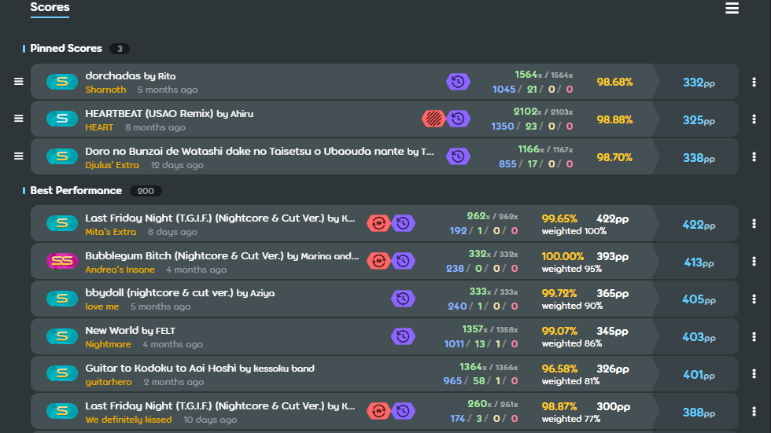

# osu! Better Profile

A Chrome extension that enhances osu! profile pages by injecting detailed score
stats — combo, hit counts (300/100/50/Miss), and beatmap max combo — directly
into pinned, top, and #1 scores, without you ever having to open each score's
page individually.


## Features

- 🎯 Adds detailed hit-count breakdowns (300/100/50/Miss) to every score box
  on a player's profile
- 🔗 Shows player combo alongside the beatmap's max possible combo (`923/1024`)
- ⚡ Works across pinned scores, top ("best") scores, and #1 ("firsts") scores
- 🔁 Automatically re-detects new scores as they load — no page refresh needed
  when navigating between profiles or clicking "Show More"
- 🌐 Supports both classic/stable and lazer scoring formats
- 🔒 Uses osu!'s official OAuth flow — your credentials never leave osu!'s own
  login page

## Screenshots



## How it works

This extension talks directly to the [osu! API v2](https://osu.ppy.sh/docs/index.html)
using OAuth. When you're on a profile page, it:

1. Watches the page for score boxes as they appear (initial load, "Show More"
   clicks, or navigating to a different profile)
2. Looks up each visible score by its ID via the osu! API
3. Injects the extra stats directly into the page next to the existing
   accuracy/pp info

Only scores that are actually visible on screen are fetched — nothing is
downloaded in bulk up front.

## Installation

Since this isn't published on the Chrome Web Store, you'll need to load it
manually:

1. Clone or download this repository
2. Open `chrome://extensions` in Chrome
3. Enable **Developer mode** (toggle in the top-right corner)
4. Click **Load unpacked** and select this project's folder
5. Finish Setup / OAuth part down below
6. Visit any osu! profile page (`https://osu.ppy.sh/users/...`) and you
   should see stats appear on score boxes 
7. (❗Press F5 every time entering a new userpage❗)

## Setup / OAuth

This extension needs its own osu! OAuth application to talk to the API:

1. Register a new OAuth application at
   [osu!'s OAuth settings page](https://osu.ppy.sh/home/account/edit#new-oauth-application)
2. Set the **Application Name** whatever you want and **Application Callback URL** to your extension's identity redirect
   URL (open **Service Worker** for this extension on chrome extension page,the URL will be printed by typing `chrome.identity.getRedirectURL()`
    —❗there might be a warning if you just copy and paste it❗. If you are concerning about it,feel free to do any research do understand what is going on)
3. Copy your **Client ID** and **Client Secret** on the **OAuth application page** into `secrets.example.js`

The first time you visit a profile page, a login popup will ask you to
authorize the app with your osu! account. After that, your token is cached
locally so you won't be prompted again until it expires.

## Project structure

```
.
├── manifest.json    # Chrome extension manifest (Manifest V3)
├── background.js    # Handles OAuth login and token caching
├── content.js        # Injected into osu! profile pages; fetches and renders stats
└── README.md
```

## Permissions

| Permission  | Why it's needed                                      |
| ----------- | ----------------------------------------------------- |
| `identity`  | Runs osu!'s OAuth login flow via `chrome.identity`     |
| `storage`   | Caches the OAuth access token locally between sessions |

## Known limitations

- Beatmap max combo isn't available for every beatmap (e.g. some converts);
  in those cases only the player's combo is shown
- Relies on osu!'s internal page structure (CSS class names); if osu!
  redesigns their profile page, the injection points may need updating

## Contributing

Issues and pull requests are welcome!

_## License_

_(add a license, e.g. MIT, if you'd like others to be able to reuse this)_

## Disclaimer

This is an unofficial, fan-made project and isn't affiliated with or endorsed
by osu! or ppy Pty Ltd.
